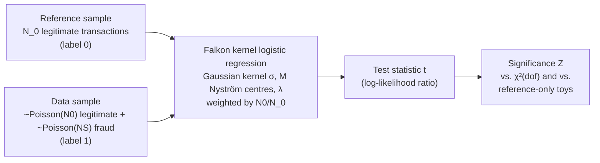

# A Fast Classifier-Based Approach to Credit Card Fraud Detection

Code for my M.Sc. thesis in **Physics of Data** at the University of Padova (2022–2023).

The thesis moves a method from high-energy physics to fraud detection. The **New Physics Learning
Machine (NPLM)** was built to spot small deviations of collider data from a reference model. Here it
checks whether a batch of card transactions contains fraud. It learns the likelihood ratio between a
reference sample of legitimate transactions and the observed data with a kernel logistic regression
(**Falkon**), and turns it into a test statistic whose distribution is calibrated against a χ²
distribution.

## Method

1. **Toys:** repeated pseudo-experiments draw a reference sample and a data sample, with or without a
   fraud component, from the dataset (two features, `V11` and `V14`, in the credit-card study).
2. **Training:** `LogisticFalkon` with a weighted cross-entropy loss. The kernel width is taken from the
   90th percentile of pairwise distances in the reference sample.
3. **Calibration:** the distribution of `t` under the reference-only hypothesis is fitted with a χ²
   distribution (best-fitting degrees of freedom). Detection power is then reported as empirical and
   χ²-based Z-scores, plus ROC and precision–recall curves.
4. **Tuning:** grid searches separate the *model* parameters (λ, M), which trade sensitivity against
   run time, from the *data* parameters: reference size N_0, expected background N0 and fraud
   component NS.

## Repository structure

| Folder | Stage |
|---|---|
| `pre-work/` | Reproduction of NPLM with Falkon on the 1D benchmark (exponential background, non-resonant signal) and degrees-of-freedom calibration (`NPLM.ipynb`, `utils.py`, *Presentation 2*) |
| `Phase-1/` | Data exploration of the credit-card dataset, the transaction simulator and a first 2D NPLM analysis with reconstruction plots (*Presentation 3*) |
| `Phase-2/` | Grid searches over N_0, N0, M and NS for the credit-card and simulated datasets, with optimised runs (*Presentation 4*) |
| `Phase-2_edited/` | Revised grid search with model and data parameters separated |
| `Phase-2-edited-2/` | Final analysis: χ² compatibility, λ/M vs. run time, significance vs. NS and N_0, result tables (`results-data/`) and *Presentation 5* |

Each phase folder contains its notebooks and the generated figures (t-distributions for reference and
data toys). `Phase-1/`, `Phase-2/` and `Phase-2_edited/` also have a short `Readme.md` with the phase
objectives and the selected parameters.

## Data

* **Credit Card Fraud Detection** (ULB Machine Learning Group, Kaggle): 284,807 European card transactions
  from September 2013, 492 of them fraudulent. PCA features `V1`–`V28`, plus `Time` and `Amount`.
  [Download](https://www.kaggle.com/datasets/mlg-ulb/creditcardfraud).
* **Simulated transactions** generated with the simulator of the
  [Fraud Detection Handbook](https://fraud-detection-handbook.github.io/fraud-detection-handbook/Foreword.html).

The datasets are not included in the repository.

## Running

The notebooks were written for Google Colab with a GPU. Their first cells install PyTorch and
[Falkon](https://github.com/FalkonML/falkon) and mount Google Drive for the data, so adjust the data
paths to your setup.

## References and credits

* R. T. D'Agnolo, A. Wulzer, *Learning New Physics from a Machine*, [arXiv:1806.02350](https://arxiv.org/abs/1806.02350).
* M. Letizia et al., *Learning new physics efficiently with nonparametric methods*,
  [arXiv:2204.02317](https://arxiv.org/abs/2204.02317): NPLM with Falkon, which the helper functions in
  `utils.py` build on.
* `Phase-1/CreditCard-dataset-analysis/Creditcard_analysis.ipynb` follows the Kaggle notebook
  [Credit Fraud – Dealing with Imbalanced Datasets](https://www.kaggle.com/code/janiobachmann/credit-fraud-dealing-with-imbalanced-datasets)
  by J. M. Bachmann, and `SimulatedDataset.ipynb` follows the transaction simulator of the Fraud
  Detection Handbook.
